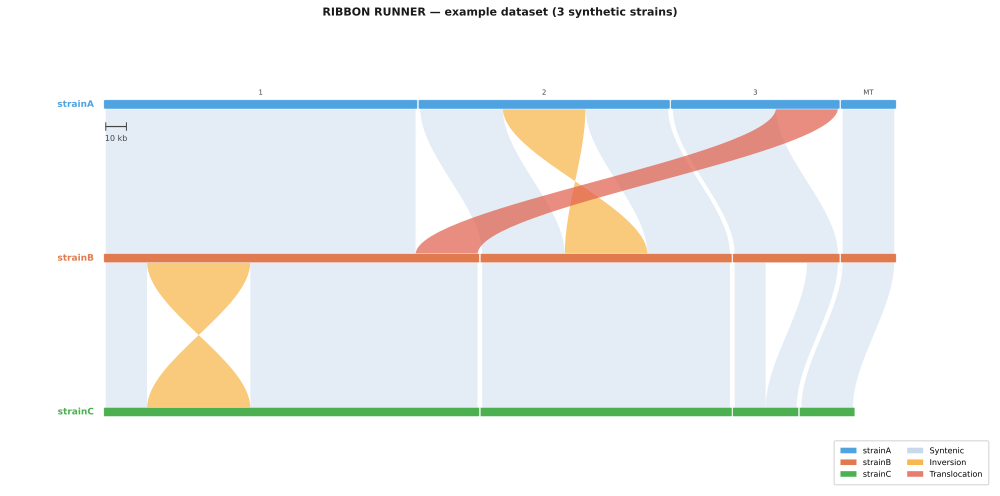

# RIBBON RUNNER

Automated whole-genome synteny ribbon figure pipeline for multiple genome
assemblies. Takes a list of FASTA files, runs adjacent-pair nucmer
alignments, and produces publication-quality SVG synteny ribbon figures in
one command.

Jun Huang, Heitman Lab, Duke University — jun.huang@duke.edu
MIT licensed. Current version: **1.3.0** (see [CHANGELOG.md](CHANGELOG.md)).



*The figure above is produced by the bundled example dataset in about two
seconds — see [Try it first](#try-it-first).*

## Install

```bash
conda env create -f environment.yml
conda activate ribbonrunner
```

That gives you Python, matplotlib and MUMmer (`nucmer`, `delta-filter`,
`show-coords`). Nothing else is required — as of v1.3.0, samtools and seqkit
are no longer needed.

`synteny_pipeline.py` and `synteny_plot.py` must sit in the same directory.

## Try it first

```bash
cd examples
python3 make_example_data.py --outdir .
python3 ../synteny_pipeline.py --input strains.txt --outdir demo
```

This generates three small synthetic genomes with a known inversion, a known
translocation and a known deletion, then runs the whole pipeline on them. If
`demo/synteny_all_chr.svg` appears and shows one orange twist, one red
ribbon and a short final row, your installation works.

## Usage

Create a **tab-separated** strains file. Order matters: strains are aligned
as adjacent pairs, `strain1 → strain2 → strain3 → ...`, and drawn top to
bottom in that order.

```
# strain_name	/path/to/assembly.fasta
NRHc5010	/path/to/NRHc5010.fasta
NRHc5028	/path/to/NRHc5028.fasta
H99	/path/to/H99.fasta
```

Run locally:

```bash
python3 synteny_pipeline.py --input strains.txt --outdir out
```

Or submit to SLURM:

```bash
python3 synteny_pipeline.py \
    --input strains.txt \
    --outdir out \
    --title "Whole genome synteny" \
    --chroms Chr1,Chr2,Chr3,Chr4 \
    --min_len 10000 \
    --min_idy 90 \
    --email your@email.edu \
    --slurm
```

Output:

- `synteny_all_chr.svg` — every chromosome found in the assemblies
- `synteny_Chr1_Chr2_Chr3_Chr4.svg` — the subset, if `--chroms` was given

## Options

| Argument | Default | Description |
|---|---|---|
| `--input` | required | Tab-separated strains file (name + FASTA path) |
| `--outdir` | required | Output directory. Must not contain spaces — nucmer cannot run in such a directory |
| `--title` | none | Figure title |
| `--chroms` | all | Comma-separated subset, e.g. `Chr1,Chr2,Chr3,Chr4` |
| `--min_chrom_len` | 0 | Ignore sequences shorter than this in the full-genome figure |
| `--min_len` | 10000 | Minimum alignment block length (bp) |
| `--min_idy` | 90.0 | Minimum sequence identity (%) |
| `--threads` | 0 | Threads for nucmer (MUMmer 4 only; 0 = single-threaded) |
| `--width` / `--height` | 16 / auto | Figure size in inches |
| `--slurm` / `--slurm_only` | off | Generate and submit / only generate a SLURM script |
| `--mem` | 32G | SLURM memory |
| `--time` | 24:00:00 | SLURM time limit |
| `--partition` | common | SLURM partition — change for your cluster |
| `--conda_init` | auto-detected | Path to `conda.sh` |
| `--conda_env` | ribbonrunner | Env to activate in the job (`''` = none) |
| `--email` | none | Email for SLURM notifications |

## How it reads your assemblies

Chromosome names are normalised across assemblies, so strains that spell
their sequences differently still line up:

| Format | Example | Normalised to |
|---|---|---|
| Already standard | `Chr1`, `MT` | `Chr1`, `MT` |
| Strain-prefixed | `NRHc5010_Chr1` | `Chr1` |
| Numeric (H99 style) | `1`, `2`, `Mt` | `Chr1`, `Chr2`, `MT` |
| Lowercase | `chr1` | `Chr1` |
| Long form | `chromosome_1` | `Chr1` |

Anything unrecognised is kept unchanged and reported. Two sequences that
would normalise to the same name is a hard error, not a silent merge.

The chromosome list in the full-genome figure comes from the assemblies
themselves, not from a fixed list, so organelles and species with more than
14 chromosomes are drawn too. Use `--min_chrom_len` to drop small contigs in
draft assemblies.

## Reading the figure

- **Pale blue** — syntenic block
- **Orange, twisted** — inversion
- **Red** — translocation (block on a different chromosome in the next strain)
- The scale bar applies to **every** row: all strains share one scale, so a
  shorter assembly ends short of the right margin. That white space is a
  real length difference.

## Notes

- `--min_len` and `--min_idy` apply consistently to both the `delta-filter`
  alignment step and the plotting step.
- The pipeline prints its alignment order before doing any work, so you can
  confirm the strain ordering before a long job starts.
- nucmer 3.23 does not support threads; pass `--threads` only with MUMmer 4.
- Every step is written into a plain shell script (`run_pipeline.sh`, or
  `ribbonrunner.sb` for SLURM) in the output directory, so you can read or
  re-run exactly what was executed.

## Citation

If RIBBON RUNNER contributed to a publication, please cite this repository
and the MUMmer suite (Marçais *et al.*, *PLoS Comput Biol* 2018).
